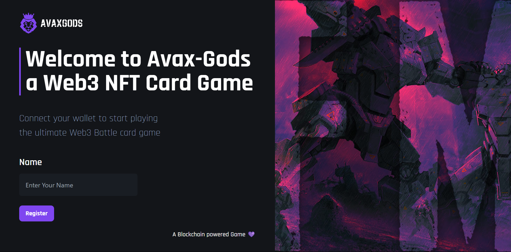
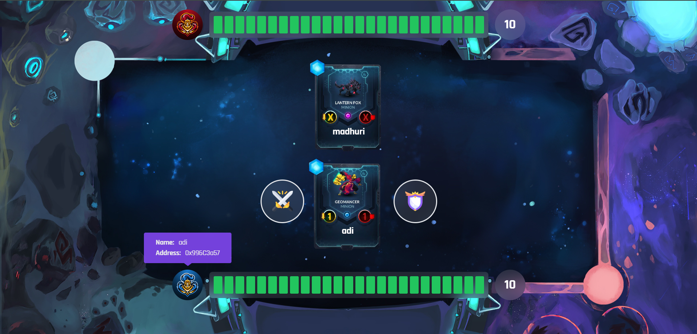
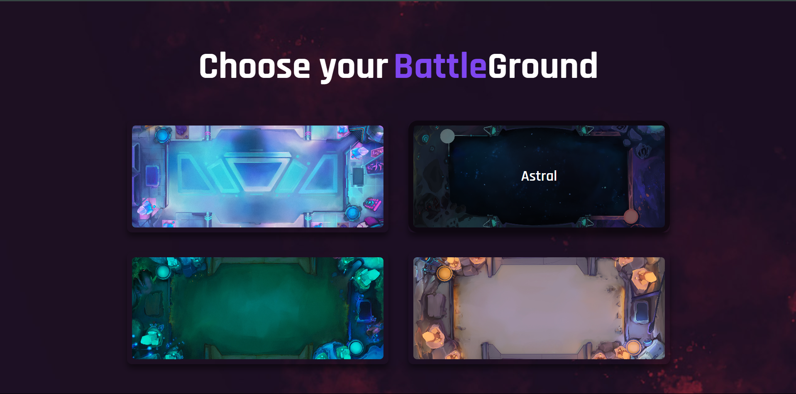
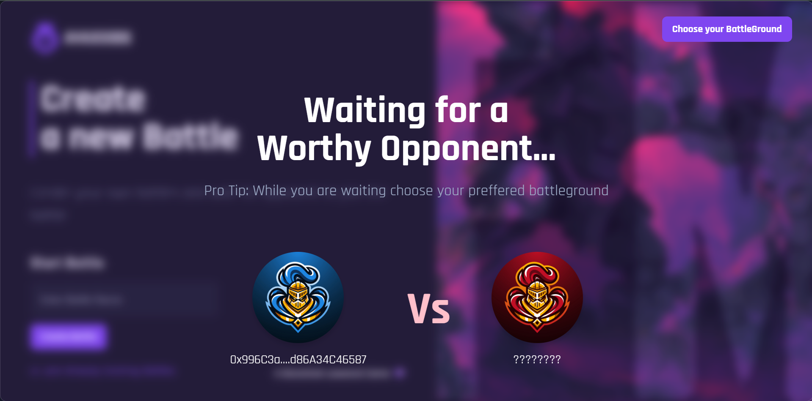
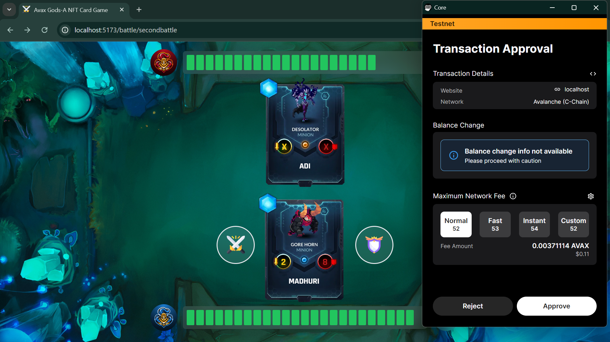
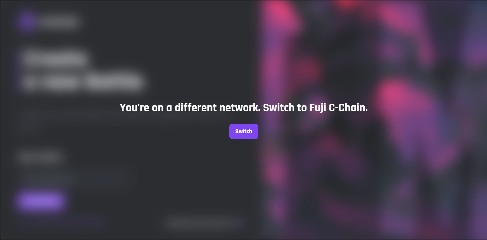

# Avax-Gods

Welcome to **Avax-Gods**, where blockchain technology meets the thrill of NFT card gaming! Avax-Gods is an innovative project that allows users to immerse themselves in a world of strategy and competition. By connecting your Core or MetaMask wallet, you can create battles or join existing ones with ease. Engage in intense battles where every move counts.



## Table of Contents

- [Introduction](#introduction)
- [Features](#features)
- [Getting Started](#getting-started)
  - [Prerequisites](#prerequisites)
  - [Installation](#installation)
  - [Usage](#usage)
- [Gameplay](#gameplay)
  - [Creating a Battle](#creating-a-battle)
  - [Joining a Battle](#joining-a-battle)
  - [Battle Mechanics](#battle-mechanics)
- [Game Rules](#game-rules)
- [Contributing](#contributing)
- [Notes](#notes)


## Introduction

Avax-Gods is a strategic NFT card game built on blockchain technology. Players can connect their Core or MetaMask wallets to engage in exciting battles, utilizing their NFT cards to attack, defend, and outsmart their opponents.



## Features

- **Blockchain Integration**: Secure and transparent transactions through Core and MetaMask wallets.
- **NFT Cards**: Unique NFT cards that you can use in battles.
- **Custom Battleground**: Select your battleground from four unique types available.
- **Interactive Battle animations and sounds**: Engaging battle animations and sounds with interactive toasts add excitement and vibrancy to the game.
- **Strategy & Competition**: Plan your moves carefully to defeat your opponents.
- **Community Engagement**: Join a vibrant community of gamers and NFT enthusiasts.



## Getting Started

### Prerequisites

Before you begin, ensure you have met the following requirements:

- You have a Core or MetaMask wallet set up.
- You have some AVAX tokens in your wallet for transaction fees.

### Installation

1. Clone the repository:
    ```bash
    git clone https://github.com/yourusername/avax-gods.git
    ```

2. Navigate to the project directory:
    ```bash
    cd avax-gods
    ```

3. Install the dependencies:
    ```bash
    npm install
    ```

### Usage

1. Start the development server:
    ```bash
    npm start
    ```

2. Open your browser and go to `http://localhost:3000` to see the application in action.

## Gameplay

### Creating a Battle

1. Connect your Core or MetaMask wallet.
2. Register your account if already not registered.
3. Navigate to the "Create Battle" section.
4. Click "Create Battle" to initiate the game.
5. You can also join an existing battle



### Joining a Battle

1. Connect your Core or MetaMask wallet.
2. Browse the list of available battles.
3. Select a battle to join.
4. Confirm your participation.

### Battle Mechanics

- **Random Card Allocation**: Each player is given a card with random attack and defense values.
- **Decision Making**: Based on the card values, players can choose to either attack or defend.



## Game Rules

1. **Card with the same defense and attack points will cancel each other out**: When two cards with identical attack and defense points clash, they both are nullified.
2. **Attack points from the attacking card will deduct the opposing player’s health points**: The attack value directly reduces the opponent's health.
3. **If P1 does not defend, their health will be deducted by P2’s attack**: An undefended attack directly reduces the defender's health.
4. **If P1 defends, P2’s attack is equal to P2’s attack - P1’s defense**: Defending reduces the impact of the attack by the defender's defense value.
5. **If a player defends, they refill 3 Mana**: Successful defense replenishes the defender's Mana by 3 points.
6. **If a player attacks, they spend 3 Mana**: Each attack costs the attacker 3 Mana points.

## Contributing

We welcome contributions to Avax-Gods! To contribute, please follow these steps:

1. Fork the repository.
2. Create a new branch (`git checkout -b feature/your-feature`).
3. Make your changes and commit them (`git commit -m 'Add some feature'`).
4. Push to the branch (`git push origin feature/your-feature`).
5. Open a Pull Request.

## Notes

- The Solidity code for Avax-Gods is written using Solidity version ^0.8.19. Ensure your development environment is compatible with this version for optimal performance and compatibility.
- The frontend of Avax-Gods is built using React and Vite, providing a fast and modern development experience.

